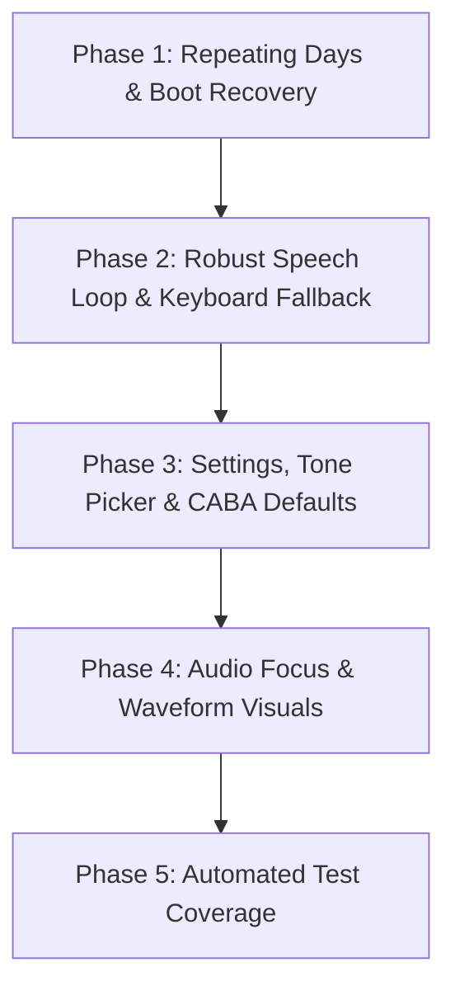

# AlarmAI Development Roadmap

This document outlines the development phases for AlarmAI, incorporating core features:
1. Repeating days support for scheduling.
2. Speech-to-Text as default with keyboard text input as fallback.
3. Default coordinates default to CABA, Argentina when GPS is unavailable.

---

## Roadmap Overview

---

## Detailed Phases

### Phase 1: Waking Reliability & Repeating Days
* Goal: Allow users to select days of the week for recurring alarms and ensure they survive device reboots.
* Tasks:
  * Update Alarm data model and PreferencesManager to serialize repeating days of the week.
  * Update AlarmScheduler to compute next alarm time based on active weekdays.
  * Implement weekdays selection row in MainActivity UI.
  * Create BootReceiver to automatically reschedule active alarms upon system reboot.

### Phase 2: Robust Speech Loop & Keyboard Fallback
* Goal: Use Speech-to-Text (STT) by default, but gracefully switch to keyboard fallback if the mic fails or times out.
* Tasks:
  * Count consecutive STT errors in AlarmViewModel. Trigger a helpful fallback prompt if errors reach 3.
  * Update AlarmActivity layouts to show a fallback OutlinedTextField, quick action chips, and a manual microphone button.

### Phase 3: Settings Customization & Argentina (CABA) Coordinates
* Goal: Configure custom coordinates default to CABA, Argentina, set custom volume, and implement a custom ringtone picker.
* Tasks:
  * Default GPS fallback coordinates to Latitude -34.6037, Longitude -58.3816 (CABA, Buenos Aires, Argentina).
  * Add alarm volume and ringtone Uri preferences, and expose UI controls in MainActivity settings.
  * Update AlarmService to apply custom volume and ringtone uri.

### Phase 4: Audio Focus & Glassmorphic Visual Polish
* Goal: Ensure audio focus pauses background music during briefings and add high-end voice animations.
* Tasks:
  * Request transient exclusive audio focus before speaking or listening in VoiceManager.
  * Capture real-time audio input levels (rmsdB) and bind them to a pulsing microphone wave visualizer in ListeningLayout.

### Phase 5: Automated Testing
* Goal: Implement unit tests and Compose UI tests to ensure regressions don't break waking schedules.
* Tasks:
  * Write unit tests for AlarmScheduler time calculations and PreferencesManager serialization.
  * Write Compose UI tests verifying MainActivity settings and day toggles.
