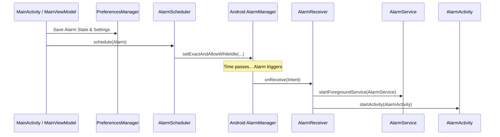
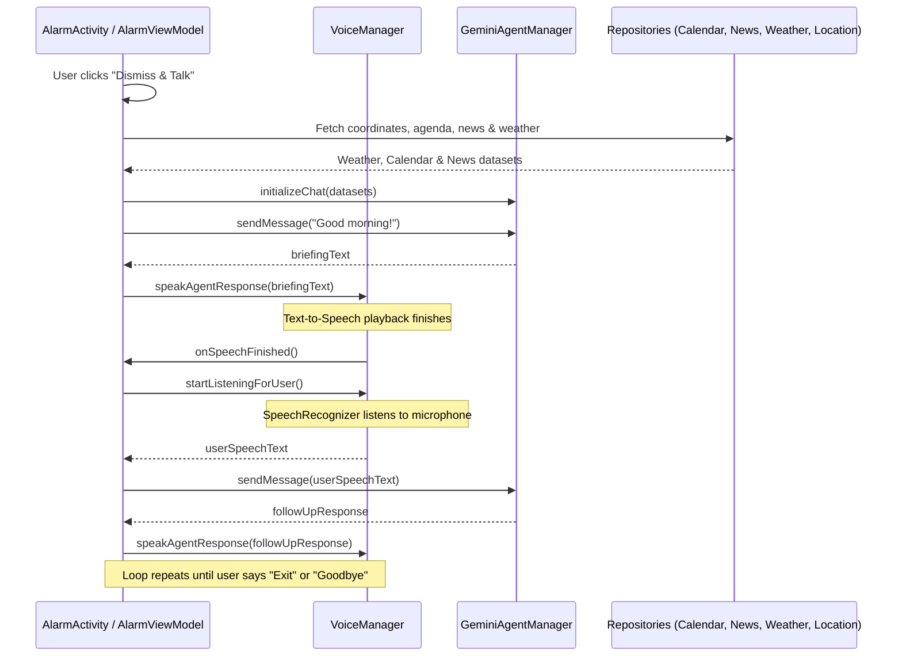

# AlarmAI System Context & Architecture Cache ⏰🤖

This document provides a comprehensive overview of **AlarmAI**, its architectural design, core components, data flows, and implementation roadmap. It serves as a persistent context "cache" for developers and agentic AI coders working on this codebase.

---

## 📌 General Overview
**AlarmAI** is a voice-powered morning assistant alarm application for Android, built using **Kotlin** and **Jetpack Compose**. Instead of a standard alarm, it uses a conversational back-and-forth speech loop powered by **Gemini 1.5 Flash** to deliver a personalized morning briefing.

Upon dismissing the alarm, the app aggregates:
1. **Local Weather**: Coordinates from GPS, queried against Open-Meteo.
2. **Personalized News**: Scraping headlines via NewsAPI/GNews based on user interest categories.
3. **Calendar Agendas**: Reading today's agenda from the Android system calendar.
4. **AI Generation & TTS**: Aggregated data is sent to Gemini to generate a cohesive briefing read out via Android's Text-to-Speech (TTS) engine.
5. **Interactive Voice Dialogue**: Speech-to-Text (STT) listens to follow-up questions, creating a hands-free conversation.

---

## 🏗️ Architecture & Component Reference

AlarmAI is structured using the **MVVM (Model-View-ViewModel)** design pattern. Below is the mapping of components and files:

### 1. Presentation Layer (UI & ViewModels)
*   **[MainActivity](file:///C:/Users/usuario/alarmai/app/src/main/java/com/mateocuello/alarmai/MainActivity.kt)**: The main entry point. Handles credentials settings (Gemini and News API keys), permission requests (Calendar, Location, Audio, and Notifications), and alarm configuration.
*   **[MainViewModel](file:///C:/Users/usuario/alarmai/app/src/main/java/com/mateocuello/alarmai/MainViewModel.kt)**: Manages state for the settings screen, loads/saves preferences, and coordinates alarm scheduling triggers.
*   **[AlarmActivity](file:///C:/Users/usuario/alarmai/app/src/main/java/com/mateocuello/alarmai/ui/alarm/AlarmActivity.kt)**: The full-screen wake-up interface. Displays over the device lockscreen when the alarm fires, providing the "Dismiss & Talk" trigger and managing the interactive briefing chat UI.
*   **[AlarmViewModel](file:///C:/Users/usuario/alarmai/app/src/main/java/com/mateocuello/alarmai/ui/alarm/AlarmViewModel.kt)**: Drives the alarm activity state machine. Manages states such as `IDLE`, `RINGING`, `SPEAKING`, `LISTENING`, and `ERROR`. Coordinates API execution and text/voice state changes.
*   **[theme](file:///C:/Users/usuario/alarmai/app/src/main/java/com/mateocuello/alarmai/ui/theme/)**: Defines dark-mode colors, typography, styles, and custom glassmorphism components.

### 2. Background Services & Receivers
*   **[AlarmScheduler](file:///C:/Users/usuario/alarmai/app/src/main/java/com/mateocuello/alarmai/receiver/AlarmScheduler.kt)**: Wraps Android's `AlarmManager` using exact alarms (`setExactAndAllowWhileIdle()`) to guarantee waking even under Android Doze mode.
*   **[AlarmReceiver](file:///C:/Users/usuario/alarmai/app/src/main/java/com/mateocuello/alarmai/receiver/AlarmReceiver.kt)**: A `BroadcastReceiver` that triggers when the scheduled alarm time arrives. It launches the foreground playback service and the wake-up activity.
*   **[AlarmService](file:///C:/Users/usuario/alarmai/app/src/main/java/com/mateocuello/alarmai/service/AlarmService.kt)**: A Foreground Service that manages ringtone playback via `MediaPlayer` with media playback type, ensuring audio continues running reliably when the device is locked.

### 3. Data & Infrastructure Layer
*   **[PreferencesManager](file:///C:/Users/usuario/alarmai/app/src/main/java/com/mateocuello/alarmai/data/local/PreferencesManager.kt)**: Handles persistence for alarm time, status, API keys, news interest topics, and cached coordinates using Android `SharedPreferences`.
*   **[Alarm Model](file:///C:/Users/usuario/alarmai/app/src/main/java/com/mateocuello/alarmai/data/model/Alarm.kt)**: Simple data model representing the scheduled alarm configuration.
*   **[LocationProvider](file:///C:/Users/usuario/alarmai/app/src/main/java/com/mateocuello/alarmai/data/repository/LocationProvider.kt)**: Uses Google Play Services `FusedLocationProviderClient` to fetch current coordinates.
*   **[CalendarRepository](file:///C:/Users/usuario/alarmai/app/src/main/java/com/mateocuello/alarmai/data/repository/CalendarRepository.kt)**: Queries Android's `CalendarContract` via `ContentResolver` to parse today's user events.
*   **[WeatherRepository](file:///C:/Users/usuario/alarmai/app/src/main/java/com/mateocuello/alarmai/data/repository/WeatherRepository.kt)**: Fetches forecasts for specific coordinates from the Open-Meteo REST API.
*   **[NewsRepository](file:///C:/Users/usuario/alarmai/app/src/main/java/com/mateocuello/alarmai/data/repository/NewsRepository.kt)**: Fetches headlines from NewsAPI/GNews according to preferred topics.
*   **[VoiceManager](file:///C:/Users/usuario/alarmai/app/src/main/java/com/mateocuello/alarmai/data/repository/VoiceManager.kt)**: Wraps Android's `TextToSpeech` and `SpeechRecognizer`, exposing simple callbacks to orchestrate the spoken conversation loop.
*   **[GeminiAgentManager](file:///C:/Users/usuario/alarmai/app/src/main/java/com/mateocuello/alarmai/data/repository/GeminiAgentManager.kt)**: Initializes the Google Generative AI `GenerativeModel`. Aggregates inputs from all data sources, prepares the conversational system instructions, and initiates a chat session. Supports fallback "Demo Mode" with simulated responses if credentials are blank.

---

## 🔄 Core Data & Interaction Flows

### 1. Alarm Scheduling & Firing Flow

### 2. AI Briefing & Speech Loop Flow

---

## 📈 Roadmap & Development Phases (Sync with `ROADMAP.md`)

This context file outlines the planned implementation phases from the **[Roadmap](file:///C:/Users/usuario/alarmai/ROADMAP.md)**:

### 📋 Phase 1: Waking Reliability & Repeating Days (In Progress)
*   **Goal**: Allow users to select specific weekdays for repeating alarms and recover scheduled alarms on device reboot.
*   **Components to Update/Create**:
    *   **[Alarm.kt](file:///C:/Users/usuario/alarmai/app/src/main/java/com/mateocuello/alarmai/data/model/Alarm.kt)**: Add `daysOfWeek: Set<Int>`.
    *   **[PreferencesManager.kt](file:///C:/Users/usuario/alarmai/app/src/main/java/com/mateocuello/alarmai/data/local/PreferencesManager.kt)**: Serialize `daysOfWeek` set into SharedPreferences.
    *   **[AlarmScheduler.kt](file:///C:/Users/usuario/alarmai/app/src/main/java/com/mateocuello/alarmai/receiver/AlarmScheduler.kt)**: Calculate next firing day from selection. Default to simple next-day/same-day calculation if no days are selected.
    *   **[MainActivity.kt](file:///C:/Users/usuario/alarmai/app/src/main/java/com/mateocuello/alarmai/MainActivity.kt)**: Render day selector row (M, T, W, T, F, S, S) and bind to UI state.
    *   **`BootReceiver` [NEW]**: A `BroadcastReceiver` matching `android.intent.action.BOOT_COMPLETED` to restore and reschedule active alarms automatically.

### 🗣️ Phase 2: Robust Speech Loop & Keyboard Fallback
*   **Goal**: Fallback gracefully to keyboard text input if SpeechRecognizer encounters errors/silence timeouts three times.
*   **Components to Update**:
    *   **[AlarmViewModel.kt](file:///C:/Users/usuario/alarmai/app/src/main/java/com/mateocuello/alarmai/ui/alarm/AlarmViewModel.kt)**: Track `consecutiveSttErrors` counter. Switch state to speaking a helpful fallback prompt if count reaches 3.
    *   **[AlarmActivity.kt](file:///C:/Users/usuario/alarmai/app/src/main/java/com/mateocuello/alarmai/ui/alarm/AlarmActivity.kt)**: Add keyboard fallback `OutlinedTextField` at the bottom, quick reply chips (e.g., "Skip", "Read Schedule"), and a microphone retry button.

### ⚙️ Phase 3: Settings Customization & Argentina (CABA) Coordinates
*   **Goal**: Add default location coordinates fallback to CABA, Argentina, and set up alarm audio custom volume/ringtone picker settings.
*   **Components to Update**:
    *   **[PreferencesManager.kt](file:///C:/Users/usuario/alarmai/app/src/main/java/com/mateocuello/alarmai/data/local/PreferencesManager.kt)**: Set default coordinates to Latitude `-34.6037` and Longitude `-58.3816` (CABA, Argentina) if GPS coordinates are unavailable. Add keys for volume and ringtone.
    *   **[MainActivity.kt](file:///C:/Users/usuario/alarmai/app/src/main/java/com/mateocuello/alarmai/MainActivity.kt)**: Add custom ringtone Uri picker (`RingtoneManager.ACTION_RINGTONE_PICKER`) and volume slider.
    *   **[AlarmService.kt](file:///C:/Users/usuario/alarmai/app/src/main/java/com/mateocuello/alarmai/service/AlarmService.kt)**: Adjust volume levels and play chosen ringtone Uri.

### 🎨 Phase 4: Audio Focus & Glassmorphic Visual Polish
*   **Goal**: Request Exclusive Audio Focus to mute background apps during briefing, and render a high-quality pulsing audio wave visual around the microphone.
*   **Components to Update**:
    *   **[VoiceManager.kt](file:///C:/Users/usuario/alarmai/app/src/main/java/com/mateocuello/alarmai/data/repository/VoiceManager.kt)**: Request/Release `AUDIOFOCUS_GAIN_TRANSIENT_EXCLUSIVE` audio focus. Expose dynamic `rmsdB` audio level callbacks to `AlarmViewModel`.
    *   **[AlarmActivity.kt](file:///C:/Users/usuario/alarmai/app/src/main/java/com/mateocuello/alarmai/ui/alarm/AlarmActivity.kt)**: Bind to volume state, render pulsing audio canvas wave in `ListeningLayout`, and apply glassmorphic styles.

### 🧪 Phase 5: Automated Testing
*   **Goal**: Secure regression safety with comprehensive unit tests and instrumented Compose tests.
*   **Components to Create**:
    *   `AlarmSchedulerTest` [NEW]: Verify weekend, weekday, and single-shot alarm computations.
    *   `PreferencesManagerTest` [NEW]: Verify SharedPreferences serialization.
    *   `MainActivityUiTest` [NEW]: Verify UI updates upon day selector interactions.

---

## 💡 Developer Gotchas & Integration Tips
*   **Background Restrictions**: Android 12+ (API 31+) restricts starting exact alarms unless permission is declared and granted. The app handles this via `checkExactAlarmPermission()` and redirects the user to the system Settings page (`Settings.ACTION_REQUEST_SCHEDULE_EXACT_ALARM`) if needed.
*   **Display Over Lockscreen**: `AlarmActivity` uses flags like `showWhenLocked`, `turnScreenOn`, and `keepScreenOn` to make sure it wakes the physical screen when the alarm goes off.
*   **Demo Mode Fallbacks**: When building and running without API keys, `GeminiAgentManager` generates simulated weather briefings, mock calendar items, and mock news headlines so that the full layout can be tested locally.
